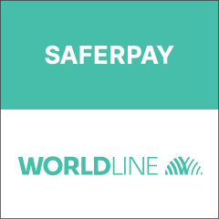
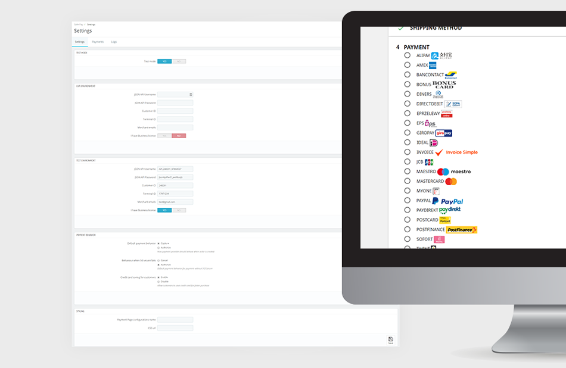

    

## Overview

Saferpay is a comprehensive e-payment solution from SIX Payment Services (part of Worldline) that provides easy, flexible, and secure payment processing for your PrestaShop online store.

**Key Features:**
- Secure payment processing with credit, debit, and prepaid cards
- Smartphone payment support
- Multi-currency support
- Comprehensive fraud protection
- Easy integration with PrestaShop

## Compatibility

> ⚠️ This module is only compatible with PrestaShop versions **1.7.6.1 and higher.**
>
> For older PrestaShop versions, please use [Saferpayofficial-1.7.6](https://github.com/Invertus/saferpayofficial-1.7.6)

## Prerequisites

Before installing the Saferpay module, ensure you have:

### Required Accounts & Credentials
- **Saferpay Backoffice Account** with valid username and password
- **API Credentials** for Saferpay Live and/or Test environments
- **Active Saferpay Terminal** for payment processing
- **Terminal ID** (Terminal ID parameter)
- **Customer ID** (CustomerId parameter)
- **Valid Acceptance Agreement** for credit cards or other payment methods

### Technical Requirements
- **PrestaShop 1.7.6.1+** installed and configured

## Installation

1. **Download the Module**
   - Get the latest version from [releases page](https://github.com/Invertus/saferpayofficial/releases)

2. **Upload to PrestaShop**
   - Install through PrestaShop admin panel

3. **Configure Module**
   - Navigate to Modules > Module Manager
   - Find "Saferpay Official" and click Configure
   - Enter your API credentials and terminal information

## Account Setup

### Test Environment
- [Login to Saferpay Test Backoffice](https://test.saferpay.com/BO/Login)
- Use test credentials for development and testing

### Live Environment
- [Login to Saferpay Live Backoffice](https://www.saferpay.com/BO/Login)
- Contact SIX Payment Services for production credentials

## About SIX Payment Services

SIX Payment Services has been part of Worldline since 2018, making it Europe's largest technology partner for banks and merchants. Worldline is the European market leader in payment technology with:

- **45+ years** of experience in payment processing
- **11,000+** payment experts across 30+ countries
- **Complete value chain** coverage for cashless payment transactions
- **Highly secure** payment and transaction services

    

## Support

For technical support and questions:
- **Documentation:** Check the module documentation in your PrestaShop admin
- **SIX Payment Services:** Contact their support team for account-related issues
- **GitHub Issues:** Report bugs or feature requests on the GitHub repository

## Contributing

Contributions are welcome! Please feel free to submit a pull request.

## License

This module requires a valid Saferpay license. Please contact SIX Payment Services for licensing information.
