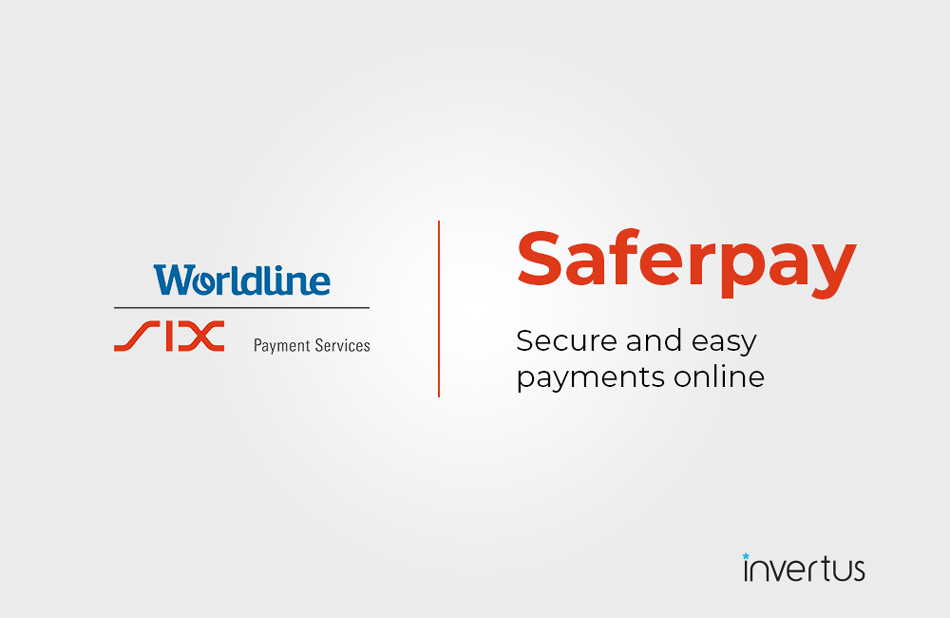

    

Saferpay - Easy, flexible, secure - The comprehensive e-payment solution from SIX Payment Services for easier and more secure payment in your online shop.

SIX Payment Services has been part of Worldline since the end of 2018, making it Europe's largest technology partner for banks and merchants. The tailor-made solutions from SIX Payment Services include a broad portfolio of payment terminals and the acceptance and processing of national and international payments with credit, debit and prepaid cards as well as the smartphone.

Worldline is European market leader in payment technology. More than 11,000 payment experts ensure future-oriented innovations and services in over 30 countries. With 45 years of experience, Worldline is an innovative pan-European company that covers the entire value chain of cashless payment transactions with its highly secure payment and transaction services.

Use of the Saferpay PrestaShop requires the following:

- A corresponding license for the Saferpay module.

- The existence of a valid identification with a username and password for the Saferpay Backoffice.
    - Respective API credentials for the Saferpay Live- and/or Test environment
    
- Availability of at least one active Saferpay terminal via which payment can be carried out and the associated
    
- Availability of Saferpay terminal number (Terminal ID parameter) and Saferpay customer number (CustomerId parameter).

- Availability of valid acceptance agreement for credit cards or other payment methods.

    

To register for live account please follow this link: https://www.six-payment-services.com/en/site/e-commerce/solutions/paymentsolution.html 

Test account information can be found here: https://www.six-payment-services.com/en/site/e-commerce-developer/testaccount.html

Please be sure to have composer installed on your device before installing the module, you can simply do that here - https://getcomposer.org/download/

<h1>Steps to use module from Github</h1>
There is a green button „Clone or download“. If you choose download zip, you will get "saferpayofficial-master.zip", you need to do the following steps:

1)    Unzip it
2)    Rename main folder from "saferpayofficial-master" to "saferpayofficial"
3)    Navigate to "saferpayofficial" directory
4)    Run this command: "composer install --no-dev --optimize-autoloader"
5)    Zip it

For more precise and detailed installation process, you can follow the screenshots below (be aware that some settings might be different on your computer, for example opening a terminal or cmd in a folder could be done in a different way on windows or linux, the screenshots below are from a Mac):

  
  
  
  
  
  
  

Now module's ZIP file is ready to be uploaded to PrestaShop!

For Windows users the steps are the same, here are the screenshots of the process:

  
  
  
  
  
  
  

